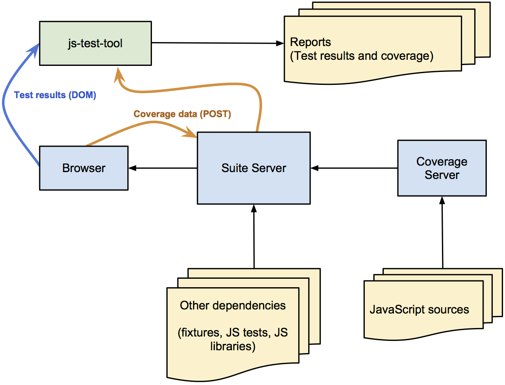

Design
======

This is a high-level description of how ``js-test-tool`` works.

During a test run, ``js-test-tool`` coordinates several processes:

1. The **browser** (or browsers) running the JavaScript test suite.
2. The **suite server** serving the test runner page and JavaScript dependencies.
3. The **coverage server** that instruments JavaScript sources to collect coverage information.

When you invoke ``js-test-tool``, this is what happens:

1. Suite description (YAML) files are parsed to determine which JavaScript files to serve.

2. A **suite server** is started, configured to serve the test runner page and JavaScript files.

3. If JSCover is configured, the **suite server** will start a **coverage server** (a JSCover instance).  The **suite server** will serve JavaScript sources from the **coverage server** (to get the instrumented version) instead of serving the sources directly.

4. A **browser** (controlled by Selenium) will request the test runner page from the **suite server**.

5. As JavaScript tests execute, the test results will be written to the DOM.

6. Once all tests complete, if coverage is configured, coverage data will be sent (via an HTTP POST request) to the **suite server**.

7. If JSCover is configured, the suite server will block until all coverage data is received.

8. Test result and coverage reports will be generated.

The image below summarizes this process:

